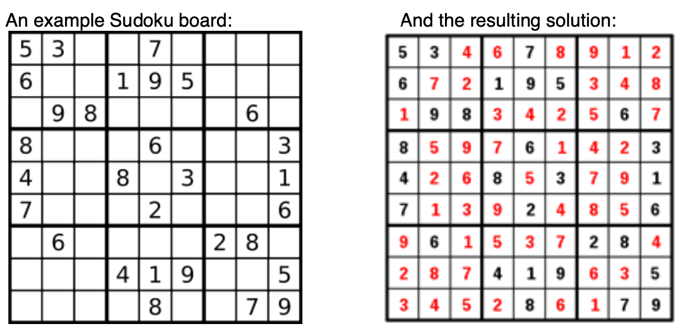

# Software Engineer Interview

There are two parts.  You have up to 2 hours and 30 minutes to complete them.  Please read both parts before starting.

### Part 1: Sudoku Plus

In this part, you will implement a program that parses a **Sudoku Plus** board input file and evaluates whether or not it denotes a valid solution.

#### What is Sudoku?

Sudoku is a number-based logic puzzle. The objective is to fill a 9×9 grid with digits so that each column, each row, and each of the nine 3×3 sub-grids that compose the grid (also called "boxes", "blocks", "regions", or "sub-squares") contains all of the digits from 1 to 9. The puzzle setter provides a partially completed grid, which typically has a unique solution. Completed puzzles are always a type of Latin square with an additional constraint on the contents of individual regions.


Description and example images from Wikipedia (http://en.wikipedia.org/wiki/Sudoku)

#### What is Sudoku Plus?

Sudoku Plus is a game we just invented which follows all the same rules of Sudoku _except_ (a) grid is of variable size, (b) grid can be rectangular (i.e., w != h), (c) cell value can be any integer.

A Sudoku Plus board might be 4x4, 9x9, 16x9, etc. All valid grids will have the following characteristics:

1. The sides of the grid are perfect squares. (E.g., w and h can be of any length drawn from this set {1, 2, 4, 9, 16, ...}.)
2. The grid can be divided into rectangular regions where the area of each region is equal to the product of the square roots of the two sides of the entire grid (i.e., w and h). Thus, on a 16x16 grid there would be 16 regions of size 4x4; on a 16x9 grid there would be 12 regions of size 4x3.
3. The numbers that can be used are not just single digits, but can be any integer.

For example, a 4x4 grid might look as follows,

| |4|2| |
|-----|-----|-----|----|
|**2**| | | |
| | | |**1**|
| |**1**|**4**| |

#### Your Task

Write a program that accepts a possible Sudoku Plus solution and evaluates whether or not it is a valid solution. Input should be in the form of a CSV (comma-separated value) text file with columns separated by comma and rows separated by newline. Example input files representing the examples shown in this document are [attached](./samples/sampleInput_4x4.txt).

This task is purposefully underspecified so that the solution can best represent what you believe to be the most important characteristics of well-written code. You should provide all source code, build scripts and instructions for how to run your program, including tests.

### Part 2 [Extra Credit]:

In this part you will perform a mock code review.  Imagine each code snippet below appears in a corresponding PR.  Your job is to submit review comments and either approve or reject the PR
based on your finding(s).

**Snippet #1**,

```c
const int SHA256_SIZE=256;

// we suppose that this function exists, and computes the sha256 hash of the input data.
void compute_sha256sum(char* out, const char* data, long data_size);

bool verify_downloaded_data(const char* data, long data_size, const char* expected_sha256) {
    char hash[SHA256_SIZE];
    compute_sha256sum(hash, data, data_size);
    return strncmp(hash, expected_sha256, SHA256_SIZE)==0;
}
```

**Snippet #2**,

```java
BigInteger n; // assume n > 2^1024

BigInteger convertLongToBigInteger(long x) {
    //A positive long x is mapped to x
    if (x >= 0)
        return BigInteger.valueOf(x);
    //A negative long x is mapped to n - |x|
    else
        return n.subtract(BigInteger.valueOf(-x));
}
```

**Snippet #3**,

```java
char[] key; // A previously set secret key

boolean verify_key(char[] challenge) {
    if (key.length != challenge.length)
        return false;
    for (int i = 0; i < key.length; ++i){
        if (key[i] != challenge[i])
            return false;
    }
    return true;
}
```
